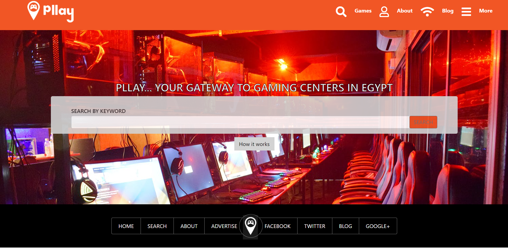

# HTML-CSS-capstone-project

</h1>This is a capstone project for practicing my HTML and CSS skills .It's responsive to both Mobile & Ipad view and includes two breakpoints md and lg.

The webpage is built using html/css/bootstrap and css positioning technologies ( FLEX GRID FLOAT ).</h1>

## Built With

Html

CSS

Visual code

Bootstrap

## Live Demo

[Live Demo Link](https://coldatlas.github.io/HTML-CSS-capstone-project/)

## Prerequisites

Text editor,Github profile and Git.

## Author

👤 Mina Anwar

- Github: [@coldatlas](https://github.com/coldatlas)

- LinkedIn: [LinkedIn](https://www.linkedin.com/in/coldyatlas/)

## Credits (Design Layout)

- Mathew Njuguna

- Sam Achola

- Kevin Mutua

## 🤝 Contributing

Contributions, issues and feature requests are welcome!

Feel free to check the issues page.

Show your support

Give a ⭐️ if you like this project!
